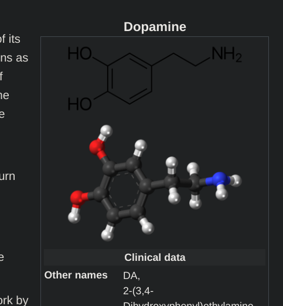
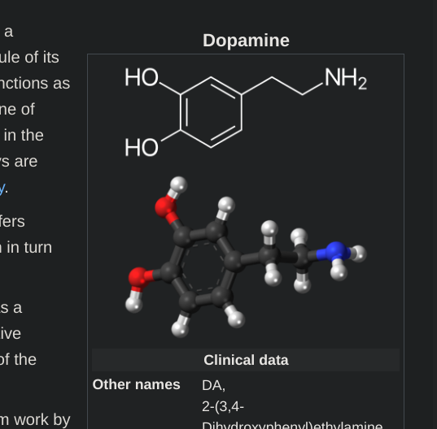

# Userscripts

Browser userscripts for ~~Greasemonkey~~ [Tampermonkey](https://www.tampermonkey.net/) or [Violentmonkey](https://violentmonkey.github.io/). Install links go to the raw *.user.js* files.

## Sean's hacker tools

Install: [Github](https://github.com/srsutherland/userscripts/raw/master/srs-hacker-tools.user.js)

A collection of functions and modifications to JS collections to make the language more convenient for ad hoc scripting, data manipulation, and [hacking](http://www.catb.org/jargon/html/H/hack.html).

## Reddit Context

Install: [Github](https://github.com/srsutherland/userscripts/raw/master/reddit-context.user.js) - [Greasy Fork](https://greasyfork.org/en/scripts/407164-reddit-context)

Automatically add context to reddit permalinks

## Wikipedia Drug invert

Install: [Github](https://github.com/srsutherland/userscripts/raw/master/wiki-drug-invert.user.js) - [Greasy Fork](https://greasyfork.org/en/scripts/396052-wikipedia-drug-invert)

A simple script to invert chemical skeletons on wikipedia pages that use `{{Template:drugbox}}` or `{{Template:Chembox}}`, for use with Dark Reader and similar extensions

| Before: | After |
| ------- | ----- |
|  | |

## RPGbot 5etools linker

Install: [Github](https://github.com/srsutherland/userscripts/raw/master/rpgbot-5etools-linker.user.js)

Links all the feature/spell/etc ratings directly to a query for them on 5e.tools

## Wordle Suggester

Install: [Github](https://github.com/srsutherland/userscripts/raw/master/wordle-suggest.user.js)

Automatically generate a list of letter combinations that fit a provided pattern from the remaining wordle letters

## CGPT response saver

Install: [Github](https://github.com/srsutherland/userscripts/raw/master/CGPT-response-save.user.js)

Helps you conveniently collect and display outputs (even those that OpenAI doesn't want you to generate) when playing around with prompts in ChatGPT.
